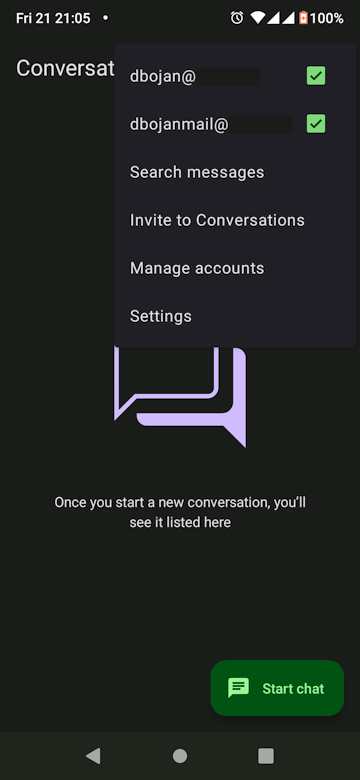
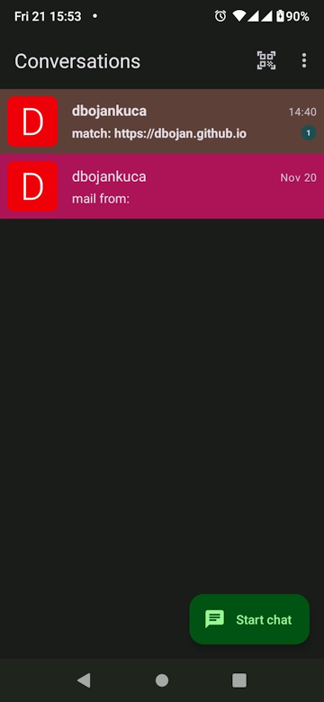

# xmpp-communicator

2025-11-21-1

**Fork of conversations xmpp app (https://codeberg.org/iNPUTmice/Conversations)**

**APK with added features**  
App name is still conversations, so it will overwrite you current installation.  
You might want to use another device for testing.  
link to apk file and modified sources: https://drive.google.com/drive/folders/1u-bBpRwNtcxRyvKruBPtkRy73MG1qzbu?usp=sharing  

Added features:  

- you can toggle xmpp accounts from the main menu
- different chat colors based on which account recieved the message  
- different sounds per account, for recieved messages

 

**Hhow to add these features yourself:**  

-since github is braindead when it comes to adding colors to text, remove + in front of green (added) lines. sorry.  

[add_colors.md](add_colors.md)

[toggle_accounts.md](toggle_accounts.md)

[custom_message_notify_sounds_per_account.md](custom_message_notify_sounds_per_account.md)

**How to open source project in android studio:**  
- open doap file in android studio
- add configuration
- edit configuration
- click on + (add new configuration), select android app

- enter configuration name: test
- module: conversations
- deploy: default apk
- ok

- connect phone to pc,
- click on play

**Ogg files**

you can create them using ffmpeg

`ffmpeg -i input.mp3 -q:a 9 message1.ogg`

