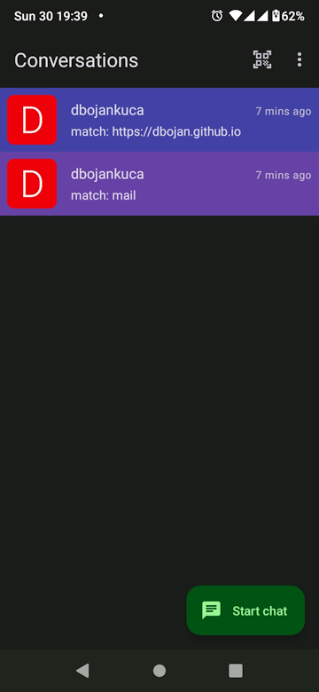
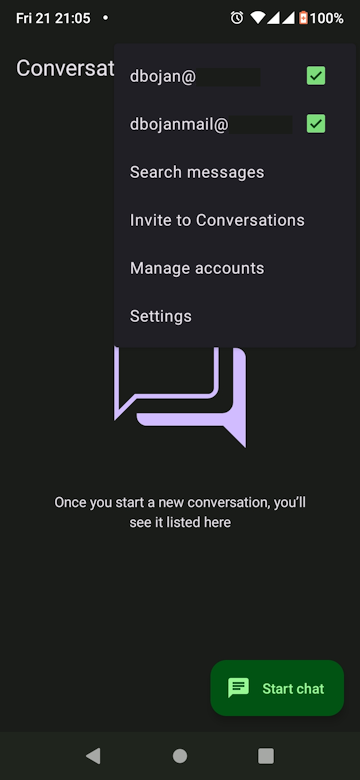
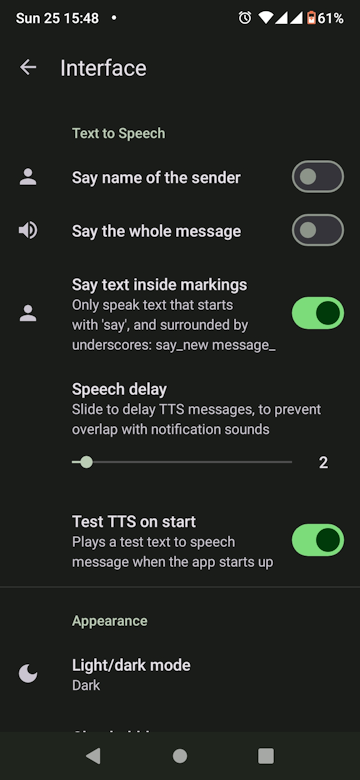

# xmpp-communicator

2026-06-19-10-34-53

**Fork of conversations xmpp app (https://codeberg.org/iNPUTmice/Conversations), with some added features**

**APK with added features**  
Link to apk install file for Android, arch: arm64-v8a (let me know if you need another arch): https://drive.google.com/drive/folders/1u-bBpRwNtcxRyvKruBPtkRy73MG1qzbu?usp=sharing  

**Make sure you grant storage permission in app properties** (for sounds)

Added features:  

- you can toggle xmpp accounts from the main menu
- different chat colors based on which account recieved the message  
- different sounds per account, for recieved messages (this was done so it can be used on older android phones. It uses Notifications/message1.ogg for account1, message2.off for account2 ...)
- added text to speech (tts), say sender name, the whole message, or just a part: say_text message_
  (make sure you have tts installed)
- added option browse (to open browser, and click on x,y coordinates)
- allowlist / blocklist for say command and browse command.

- **you can also change name of the sender, per chat**. Just click on sender, then edit, and enter new nickname. (So same sender can be named Jack in one chat and John in another. This is part of the original Conversations app.)

   

**Ogg files**

you can create them using ffmpeg

`ffmpeg -i input.mp3 -q:a 9 message1.ogg`

**Licence**

Since conversations is relaeased under GPL 3, I gueess this is too. 

I wouldn't mind BSD either.

**Changes**

2026-06-19-10-34-53
- small cosmetic changes

2026-06-14-13-30-00  
- added option browse (to open browser, and click on x,y coordinates)
- allowlist / blocklist for say command and browse command.

2026-01-25-1  
- added tts, say sender name, message, or just part say_text message_

2025-11-30-1  
- more changes in colors, added more settings for colors

2025-11-29-1  
- reworked colors for chat, so number of account based colors is basically unlimited.
    

